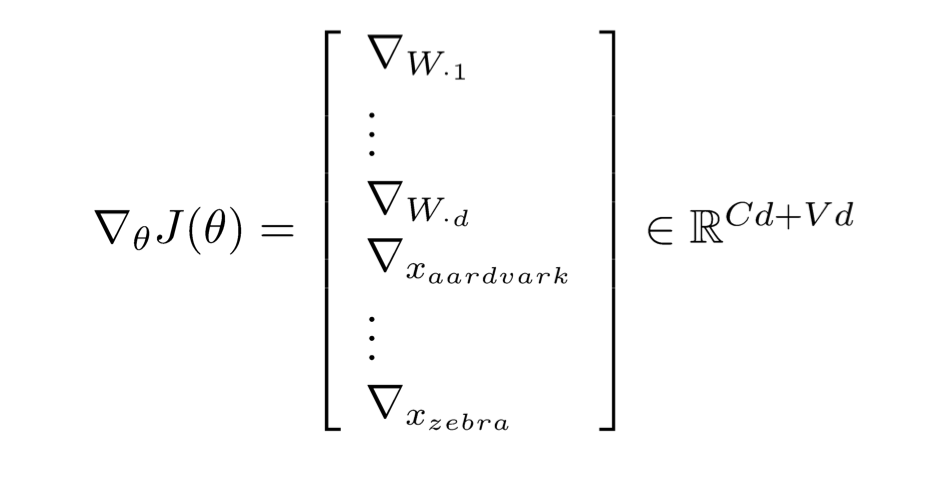

# learn-WordWindow

## 1. Word window classification

根据word的context来给word分类，比如实体识别（person, location, organization, none of above），比如词性识别（名词，形容词，副词，介词等；在进行text classification选取word时，有可能只选取noun和adjective）。

Many possibilities exist for classifying one word in context, e.g. averaging all the words in a window but that looses position information

与text classification类似，可以选取一些word组成一个feature，然后根据这个feature来做classification。Word window的大小是固定的，所以选取的词的个数是固定的，feature的维度是固定的。Train softmax classifier by assigning a label to a center word and concatenating all word vectors surrounding it. 

## 2. 所拟合的变量的选取

可以固定word vector x，就只有系数W需要拟合更新。如果数据量大的话，word vector x也可以放开拟合，word vector x和系数W都需要在拟合过程中不断更新。

## 3. Gradient descent and back propagation

## 4. Matrix multiplication

There are two expensive operations in the softmax: The matrix multiplication f=Wx and the exp.

A for loop is never as efficient when you implement it compared to a large matrix multiplication!

## 5. Softmax and logistic classification

## 6. Neural nets

Basic neural network

## 7. Deep learning

For example, recurrent neural network or recursive neural network.
